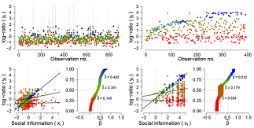
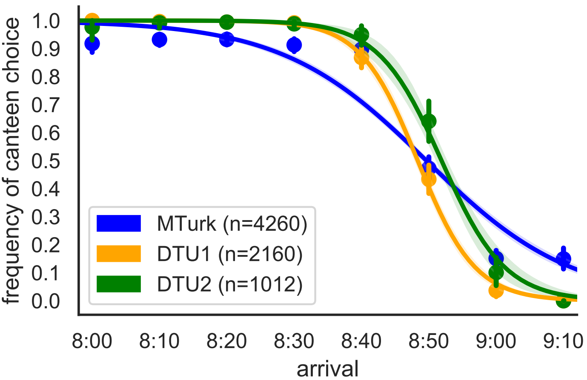

<!-- Global site tag (gtag.js) - Google Analytics -->

---
layout: frontpage
title: Robin Engelhardt
description: Robin Engelhardt is currently working at the Center for Information and Bubble Studies at the University of Copenhagen - Denmark.
keywords: learning games, social epistemology, online experiments, science writing
---

  

      <ul class="nav">
          <li><a href="">projects and publications</a></li>
      </ul>
  

<table class="wide">
<tr>
  <td class="left">
    
  </td>
  <td class="right">
    
  </td>
</tr>
<tr>
  <td class="left">
    
  </td>
  <td class="left">
    
  </td>
</tr>
</table>

  

      <ul class="nav">
          <li><a href="morefigs.html">more projects and publications</a></li>
      </ul>
  

<!--

<footer>
  
<small>
    Site design and code was cloned and adapted from
    <a href="https://kbroman.org">Karl Bromans</a>
    <a href="https://kbroman.github.io/simple_site">simple github site</a>.
  </small>

</footer>
-->
