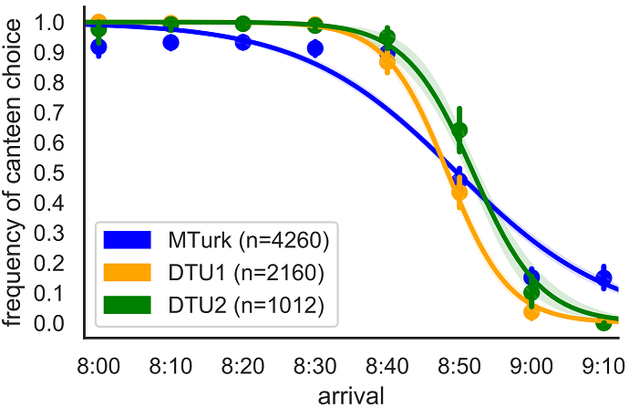

  

      <ul class="nav">
          <li><a href="{{ BASE_PATH }}/assets/pdfs/CVRobinEngelhardt_2020.pdf">cv</a></li>
          <li><a href="https://scholar.google.com/citations?user=jQufe6wAAAAJ&hl">scholar</a></li>
          <li><a href="https://github.com/gavstrik">github</a></li>
          <li><a href="https://twitter.com/robinengelhardt">@robinengelhardt</a></li>
      </ul>
  

<table class="wide">
<tr>
  <td class="left">
    
  </td>
  <td class="right">
    
  </td>
</tr>
<tr>
  <td class="left">
    
  </td>
  <td class="left">
    
  </td>
</tr>
</table>

  

      <ul class="nav">
          <li><a href="morefigs.html">more figures</a></li>
      </ul>
  

<footer>
  
<small>
    Site design and code was cloned and adapted from
    <a href="https://kbroman.org">Karl Bromans</a>
    <a href="https://kbroman.github.io/simple_site">simple github site</a>.
  </small>

</footer>
