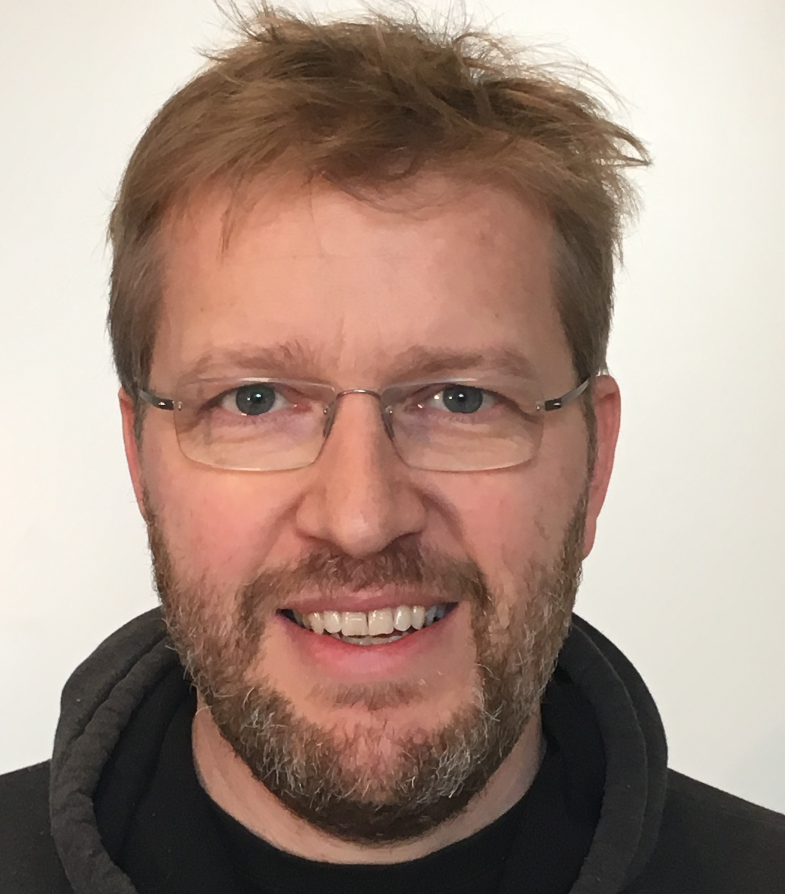

Robin Engelhardt is currently working at the [Center for Information and Bubble Studies](https://www.bubblestudies.dk) at the University of Copenhagen - Denmark; doing online experiments and research in collective phenomena, learning games, and social epistemology.

Robin received a BS in [theoretical chemistry](https://www.ku.dk/) in 1993, from the
University of Copenhagen, and a PhD in complex systems in 1998 from the
[Niels Bohr Institute](http://nbi.dk); his PhD advisors were
[Axel Hunding](https://www.researchgate.net/scientific-contributions/2006150665_Axel_Hunding) and
[Kim Sneppen](https://www.nbi.ku.dk/english/staff/?pure=en/persons/41236).
He was a postdoctoral fellow with
[Kjeld Rasmussen](https://ign.ku.dk/english/employees/geography/?pure=en/persons/96818)
at the
[Department of Geoscience](https://ign.ku.dk/english/),
and with
[Vincent F. Hendricks](https://comm.ku.dk/staff/?pure=en/persons/30701)
at the
[Department of Communication](https://comm.ku.dk/).

Karl is an applied statistician focusing on problems in genetics and
genomics &ndash; particularly the analysis of meiotic recombination and the
genetic dissection of complex traits in experimental organisms. The
latter is often called &ldquo;QTL mapping.&rdquo; A QTL is a
_quantitative trait locus_ &ndash; a genetic locus that influences a
quantitative trait. He is enthusiastic about the value
of interactive data visualizations for exploring high-dimensional genetic data;
see his [R/qtlcharts package](https://kbroman.org/qtlcharts) and
his [D3 examples](https://www.biostat.wisc.edu/~kbroman/D3).

[curriculum vitae ]({{ BASE_PATH }}/assets/CVRobinEngelhardt_2020.pdf) 
[orcid](https://orcid.org): [0000-0002-7162-0990](https://orcid.org/0000-0002-7162-0990) 
[google scholar](https://scholar.google.dk/citations?user=jQufe6wAAAAJ&hl) 
[pubmed](https://www.ncbi.nlm.nih.gov/pubmed/?term=broman+kw) 
[github](https://github.com/gavstrik) 
[blog](https://robinengelhardt.info)  

---

<h4>contact</h4>

    

        

            <a href="https://komm.ku.dk/ansatte/?pure=en/persons/9895">Robin Engelhardt</a> 
            <a href="https://bubblestudies.dk">Center for Information and Bubble Studies</a> 
            <a href="https://comm.ku.dk/">Department of Communication</a> 
            Karen Blixens Plads 8 
            2300 Copenhagen S 
            Denmark  

            

            Email: <code>rob</code><b>I</b><code>in</code><b>don't</b><code>@</code><b>want</b><code></code><b>spam!
            </b><code></code><b>So</b><code></code><b>please</b><code>hum</code><b>leave
            </b><code>.</code><b>me</b><code>ku</code><b>alone</b><code>.</code><b>!</b><code>dk</code> 
            Phone: +45-26-300-403
            

        

        

        
        

    

